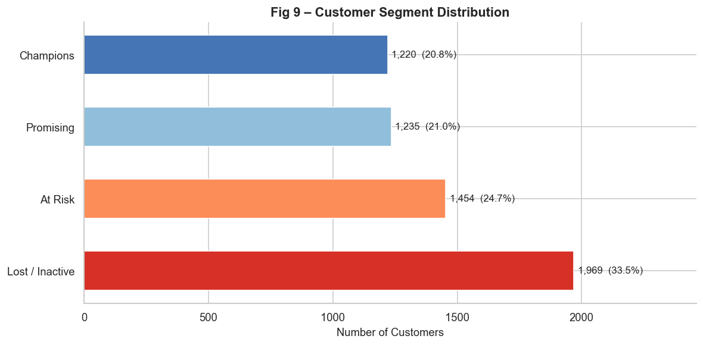

# Customer Segmentation — RFM Analysis & KMeans Clustering


[](https://customer-segmentation-pius.streamlit.app/)


A customer segmentation project built on real transactional data from a UK-based online retailer. The goal was to group ~5,800 customers into meaningful segments based on how recently they bought, how often they buy, and how much they spend — then use those segments to recommend business actions.

---

## Why I Built This

My previous project was a churn prediction model — a supervised task where the label already exists and you are training a model to predict it. This felt like the right time to explore the unsupervised side of things.

Customer segmentation made sense as a next step. Instead of predicting a single outcome, I wanted to understand the structure of customer behaviour on its own terms. RFM is one of the most practical frameworks for that — it is used in real marketing analytics, and building it from scratch on messy transactional data felt like a more honest learning exercise than starting from a pre-cleaned dataset.

---

## The Dataset

**UCI Online Retail II** — transactional records from a UK-based online retailer (2009–2011).

| | |
|---|---|
| Raw rows | 1,067,371 |
| After cleaning | 779,425 |
| Customers segmented | 5,878 |

The raw data had a significant amount of noise — missing customer IDs, cancelled invoices (prefixed with `C`), zero-quantity rows, and duplicate entries. Roughly 287,000 rows were removed before any modelling started.

---

## Workflow

### 1. Cleaning

Removed rows with no customer ID (can't segment what you can't identify), stripped out cancellations, filtered negative and zero quantity/price entries, and dropped exact duplicates. Customer IDs also had a float format issue (e.g. `12345.0`) that needed handling before grouping.

### 2. RFM Feature Engineering

Calculated three features per customer:

- **Recency** — days since their last purchase relative to a snapshot date
- **Frequency** — number of distinct orders placed
- **Monetary** — total revenue generated

One row per customer. This is the only input the clustering model sees.

### 3. Outlier Handling

Capped extreme values at the 1st and 99th percentile for each feature. A small number of very large corporate buyers were pulling the cluster centroids significantly — clipping brought the distribution back to something representative of the typical customer base.

### 4. Log Transformation

The Monetary distribution was heavily right-skewed. Most customers spent modest amounts, but a long tail of high spenders stretched the scale considerably. Applying `log1p` compressed that tail and produced distributions closer to normal — which matters because KMeans uses Euclidean distance and performs better when features are not dominated by extreme values.

This step also applied to Recency and Frequency, both of which showed similar skewness.

### 5. Scaling

Used `StandardScaler` after the log transform (not before). The scaler was fitted on log-transformed values, so the saved scaler expects the same transformation at prediction time — something the Streamlit app handles correctly.

### 6. Finding the Right K

Ran KMeans for K = 2 through 10, recording inertia and silhouette score at each step.

| K | Silhouette Score |
|---|---|
| 2 | 0.4415 (auto-selected) |
| 3 | 0.3498 |
| **4** | **0.3707** |
| 5 | 0.3405 |

The silhouette score peaked at K=2 mathematically. But two clusters only produces "active" and "inactive" — not useful for targeted marketing. K=4 had the second highest silhouette score and the elbow in the inertia curve sits right there. More importantly, four clusters map naturally to four distinct business strategies, which is the whole point of segmentation.

### 7. Cluster Labelling

After training, each cluster was profiled by its average RFM values. Clusters were then labelled using a simple rule-based system: highest frequency and monetary → Champions, highest recency (longest ago) → Lost / Inactive, second highest recency → At Risk, remainder → Promising.

---

## Results

| Segment | Customers | Share |
|---|---|---|
| Champions | 1,220 | 20.8% |
| Promising | 1,235 | 21.0% |
| At Risk | 1,454 | 24.7% |
| Lost / Inactive | 1,969 | 33.5% |

The most notable finding is that over a third of the customer base had already gone quiet by the snapshot date. That is a real retention problem for this business, and it shows up clearly when you look at the segment distribution — Lost / Inactive is the single largest group, nearly twice the size of Champions.



---

## Business Insights

**Champions (20.8%)** — Bought recently, buy often, spend the most. Reward them before they drift. This is the group to protect at all cost.

**Promising (21.0%)** — Recent buyers who haven't yet formed a habit. The right nudge — a follow-up email, a loyalty incentive — can move them toward Champions.

**At Risk (24.7%)** — Were good customers but haven't returned. A win-back campaign with a time-limited discount is the standard play here.

**Lost / Inactive (33.5%)** — Last purchased a long time ago, low spend. Re-engagement is expensive on this group. Better to survey, identify the recoverable ones, and suppress the rest from regular campaigns.

---

## Streamlit App

[](https://customer-segmentation-pius.streamlit.app/)

The app lets you input Recency, Frequency, and Monetary values for any customer and get an instant segment prediction.

Under the hood: the input goes through `log1p` transformation (matching what the scaler was trained on), then StandardScaler normalisation, then KMeans cluster assignment. The cluster index maps to a segment name using the saved label map.

The app also renders a scatter plot showing where the predicted customer sits relative to the full customer base — useful for understanding how typical or unusual the prediction is.

A batch CSV upload option is also available if you want to score multiple customers at once.

**Pages:**
- Overview — dataset summary and segment breakdown
- Predict Segment — single customer RFM input
- Cluster Insights — RFM profiles and business recommendations per segment
- Visualisations — distribution chart, scatter plot, PCA projection, summary table

---

## Folder Structure

```
customer-segmentation/
│
├── app.py                          # Streamlit app
├── customer_segmentation.ipynb     # Full analysis notebook
├── requirements.txt
├── README.md
│
├── models/
│   ├── kmeans_model.joblib
│   ├── scaler.joblib
│   └── segment_label_map.joblib
│
└── images/
    ├── segment_distribution.png
    ├── cluster_heatmap.png
    ├── pca_clusters.png
    ├── optimal_k.png
    ├── rfm_outliers.png
    ├── rfm_transformed.png
    ├── eda_distributions.png
    ├── eda_top_countries.png
    └── eda_monthly_revenue.png
```

---

## How to Run

**1. Clone the repo**
```bash
git clone https://github.com/profpius/customer-segmentation.git
cd customer-segmentation
```

**2. Install dependencies**
```bash
pip install -r requirements.txt
```

**3. Launch the app**
```bash
streamlit run app.py
```

The model files are already saved in `models/` — no need to re-run the notebook before using the app.

To reproduce the full analysis, open `customer_segmentation.ipynb` and run all cells. You will need a Kaggle API token to download the dataset automatically (instructions are in the notebook).

---

## Tech Stack

| Tool | Purpose |
|---|---|
| pandas, numpy | Data cleaning and RFM feature engineering |
| scikit-learn | KMeans, StandardScaler, PCA, silhouette score |
| matplotlib, seaborn | Visualisation |
| joblib | Model serialisation |
| Streamlit | Interactive web app |
| kagglehub | Dataset download |
